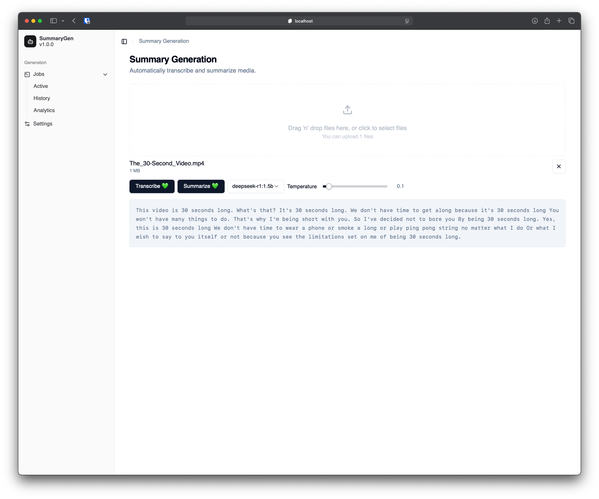
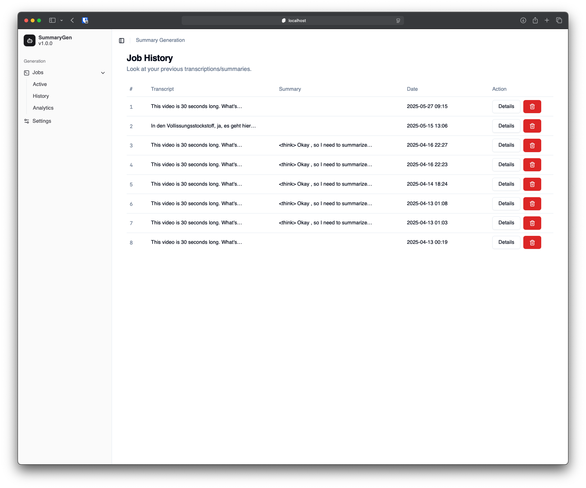
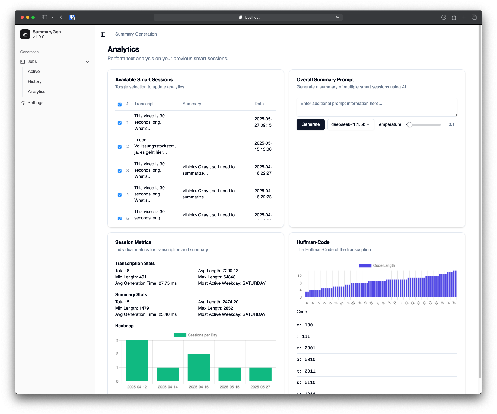

# Smart Session Summary

This project is an automatic summarization tool that transcribes and summarizes video/audio recordings using [whisper.cpp](https://github.com/ggerganov/whisper.cpp). The summary generation can be performed by an arbitrary OpenAI instance (e.g. self-hosted). It processes media files using `ffmpeg`, transcribes them with `whisper`, and summarizes them with the configured OpenAI instance. The frontend interface is built using SvelteKit and communicates with the backend via `gRPC`.

## Features

- [x] Transcribe audio and video files into text
- [x] Generate meeting summaries from transcripts
- [x] gRPC-based communication between the backend and frontend
- [x] SvelteKit-based web interface for user interaction
- [x] Persistence
- [x] Analytics backend
- [x] Analytics frontend

Here is a preview of the current working state:

### Transcription



### History



### Analytics



## Installation

> **Note**: Setting up an OpenAI instance can be skipped, I configured an [Ollama](https://ollama.com) instance with `deepseek-r1:1.5b` and `deepseek-r1:14b` models on my Oracle VM at https://engelbert.ip-ddns.com. This is already configured in the `compose.yml`.

The recommended approach is running the meeting summary tool as a docker compose project. When using the docker compose project, the only thing that needs to be configured is the OpenAI instance that will be used for the summary generation. This can be configured inside the [compose.yaml](./compose.yaml) by altering the `worker` service:

```yaml
services:
  worker:
    ...
    environment:
      - OPENAI_ENDPOINT=http://host.docker.internal:11434
      - OPENAI_TOKEN=""
```

As specified above, the default endpoint is `host.docker.internal:11434`, which just points to the host that runs docker. This configuration works with OpenAI instances that are self-hosted (e.g. via [Ollama](https://ollama.com/)) on the host machine. Alternatives to that are:

 -  Using the official [OpenAI](https://api.openai.com/) or the [DeepSeek](https://api.deepseek.com) API. **Note that this will probably result in costs for you, as these official APIs charge a price per query/tokens**.
 - Using a self-hosted OpenAI instance that runs somewhere else. In this case you just need to set the `OPENAI_ENDPOINT` variable to the host that runs your instance.

The only important thing here is that the OpenAI endpoint hosts an API that conforms to the [OpenAI API reference](https://platform.openai.com/docs/api-reference/introduction).

Once that is configured, you just need to execute the following command in the root directory of the repository:

```sh
docker compose up -d
```

This automatically downloads all required dependencies and starts the worker and frontend. The frontend is then reachable at http://localhost:8080

## Usage

1. Upload an audio or video file via the web interface.
2. The worker processes the media file using `ffmpeg`.
3. `whisper.cpp` transcribes the audio.
4. The transcription is streamed to the web interface.
5. Start a summary for the current transcription.
6. View your previous transcripts and summaries as smart sessions

## Development Prerequisites
Ensure you have the following dependencies installed before building and running the project:

### Dependencies

 - [Docker](https://www.docker.com)
 - [CMake](https://cmake.org)
 - [LLVM](https://llvm.org)
 - [Java](https://openjdk.org)
 - [Kotlin](https://kotlinlang.org)
 - [Ninja](https://ninja-build.org)
 - [nodejs](https://nodejs.org/)
 - [ffmpeg](https://ffmpeg.org)
 - [protobuf](https://protobuf.dev)
 - [grpc](https://grpc.io)

### Additional Requirements
Download a Whisper model before running the project. Models are available at [Whisper.cpp models](https://github.com/ggerganov/whisper.cpp#usage). Example:
```bash
cd services/worker/models
wget https://huggingface.co/ggerganov/whisper.cpp/resolve/main/ggml-tiny.bin
```

Note that this must not be done when the project is started via docker compose.

### Installation
Clone the repository and navigate to the project directory:
```bash
git clone https://github.com/multimedia-workforce/summary-gen.git
cd summary-gen
```

#### Running the Worker
```bash
cd services/worker
cmake --preset=<os>-64-release
cmake --preset=<os>-64-release --build
./build/<os>-64-release/worker models/ggml-tiny.bin 50051
```

Where `<os>` is one of `mac`, `win`, `lin`. The worker will now listen for grpc messages at `localhost:50051`

#### Setting Up the Frontend
```bash
cd frontend
npm install
npm run dev
```
The frontend should now be available at http://localhost:5173.
